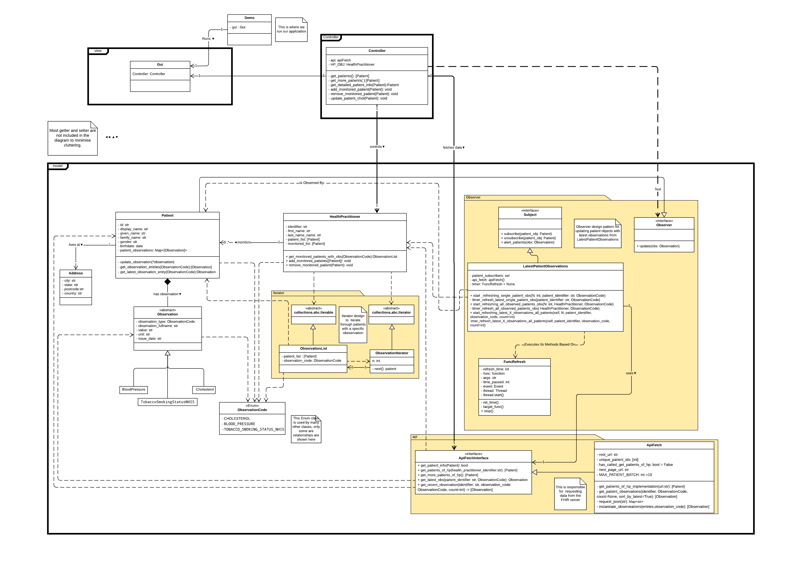

# FHIR python desktop application

A patient monitoring application, built using object oriented principles and architectural patterns.

## UML Class Diagram

### Design patterns used

* MVC
* Observer
* Iterator

### Design Principles

* Open-Closed Principle (OCP)
* Liskov Substitution Principle (LSP)
* Dependency Inversion Principle (DIP)

## Libraries

* Tkinter (frontend)
* Pandas
* Matplot
* Numpy

## Run

`python src/demo.py`

## Screenshot

